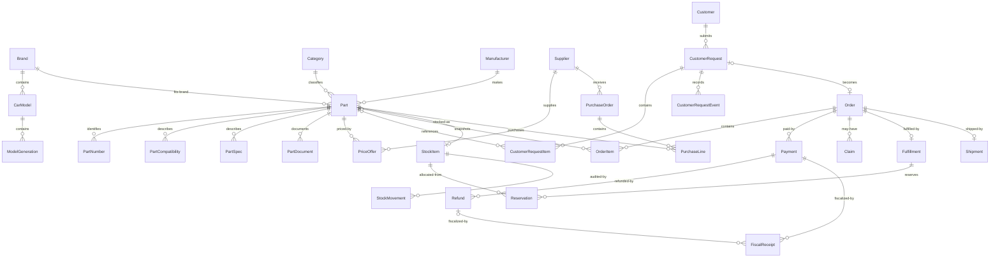

# Current database structure report

**Snapshot date:** 2026-08-29  
**Scope:** the local Django database used by this checkout  
**Database:** `backend/data/zemazap_django.sqlite3` (`django.db.backends.sqlite3`)

This report is based on the Django model registry, applied migrations, and direct row counts from the local database. It describes the local development state only. Production is designed to use PostgreSQL, so these counts must not be treated as production data.

## Executive summary

- Django currently defines **52 ORM models**: 46 application models and 6 Django framework models.
- SQLite currently contains **56 physical tables**, including migration and many-to-many support tables.
- All repository migrations are applied and Django reports no pending model migration.
- The application tables contain **254 domain rows**. Almost all of these are seeded catalogue and request demonstration data.
- The local authentication store contains **1 active staff superuser**, 6 RBAC groups, and 222 permissions. There were no stored sessions at snapshot time.
- Orders, payments, refunds, fiscal receipts, warehouse stock, purchases, reservations, movements, and CDEK shipments are all empty.
- The catalogue's `PriceOffer.stock` value is descriptive supplier text. Physical quantities belong exclusively to `warehouse.StockItem`, which is currently empty.

## High-level relationship map



## Model inventory

### Django framework and access control

| Model/table | Purpose | Rows |
|---|---|---:|
| `auth.User` / `auth_user` | Admin accounts and password hashes | 1 |
| `auth.Group` / `auth_group` | Dormant RBAC templates retained for future staff growth | 6 |
| `auth.Permission` / `auth_permission` | Per-model and custom permissions | 222 |
| `contenttypes.ContentType` / `django_content_type` | Django model registry | 52 |
| `sessions.Session` / `django_session` | Server-side login sessions | 0 |
| `admin.LogEntry` / `django_admin_log` | Django admin audit log | 0 |

The requested local superuser is active, staff-enabled, and superuser-enabled. Its password is stored only as a Django password hash. It is the only active back-office persona and uses `/admin/owner/` as its primary dashboard. The requested development credential is intentionally weak and must be rotated or removed before the database is shared or used outside local development. The six RBAC groups remain unassigned permission templates for future hiring; they do not create additional active user types.

### Core configuration and compliance

| Model/table | Main data | Rows |
|---|---|---:|
| `core.SiteSettings` | Brand, public contacts, URLs, policy versions, bank review flag | 0 |
| `core.LegalEntitySettings` | Seller identity, tax mode, bank and address details | 0 |
| `core.LegalDocument` | Versioned policy, consent, terms, delivery, payment, warranty, return texts | 0 |
| `core.RetentionPolicy` | Retention periods for requests, orders, notifications, audit, and test data | 0 |

The three settings records use a singleton constraint. Defaults exist in model code, but no rows have been saved. Public legal content and production seller details therefore remain launch blockers.

### Catalogue and supplier offers

| Model/table | Relationship or purpose | Rows |
|---|---|---:|
| `catalog.Brand` | Vehicle brand | 10 |
| `catalog.CarModel` | Many per brand; `(brand, slug)` is unique | 22 |
| `catalog.ModelGeneration` | Many per car model | 41 |
| `catalog.Category` | Part classification | 8 |
| `catalog.Manufacturer` | Part maker; unique name | 11 |
| `catalog.Supplier` | Supplier directory | 1 |
| `catalog.Part` | Central sellable part record | 12 |
| `catalog.PartDocument` | Certificates, declarations, warranty files, instructions | 0 |
| `catalog.PartNumber` | OEM, article, and analogue lookup values | 48 |
| `catalog.PartCompatibility` | Free-text compatibility entries | 24 |
| `catalog.PartSpec` | Name/value specifications | 48 |
| `catalog.PriceOffer` | Supplier price and descriptive availability | 12 |

`Part.slug` and non-null `Part.legacy_id` are unique. Category, brand, and manufacturer deletion is protected while parts reference them. Part-owned detail rows cascade when a part is deleted. Price offers are commercial proposals, not inventory ledger entries.

### Customers and requests

| Model/table | Main data | Rows |
|---|---|---:|
| `customers.Customer` | Display name, contact, unique normalized contact | 3 |
| `leads.CustomerRequest` | Request source/status, customer contact, vehicle, consent evidence | 4 |
| `leads.CustomerRequestItem` | Requested part snapshot, article, quantity, price | 6 |
| `leads.CustomerRequestEvent` | Request activity history | 4 |

Requests preserve privacy-policy and consent versions, acceptance time, source, IP address, and user agent. A request may reference a normalized customer and may become exactly one order. Part links on request items use `SET_NULL`, preserving the captured item text if the catalogue record is removed.

### Orders, payments, fiscalization, refunds, and claims

| Model/table | Main relationship or invariant | Rows |
|---|---|---:|
| `orders.Order` | Optional one-to-one request; unique UUID token | 0 |
| `orders.OrderItem` | Product and fiscal snapshot; line total recalculated on save | 0 |
| `orders.OrderStatusHistory` | Append-only status history | 0 |
| `orders.OrderComment` | Manager notes | 0 |
| `payments.Payment` | Many per order; unique public UUID and idempotency key | 0 |
| `payments.PaymentEvent` | Provider event payloads | 0 |
| `payments.PaymentAttempt` | Individual provider attempts | 0 |
| `payments.PaymentProviderCredentialRef` | Reference to an external secret, not the secret itself | 0 |
| `fiscal.FiscalReceipt` | Sale or refund receipt linked to payment/order | 0 |
| `fiscal.FiscalReceiptItem` | Fiscal line snapshots | 0 |
| `fiscal.FiscalReceiptEvent` | Fiscal provider event payloads | 0 |
| `refunds.Refund` | Protected payment/order links; unique public UUID and idempotency key | 0 |
| `refunds.RefundItem` | Refunded order item and amount | 0 |
| `refunds.RefundEvent` | Refund history/provider payload | 0 |
| `refunds.Claim` | Customer claim; optional order | 0 |

Order items intentionally duplicate names, prices, condition, delivery, warranty, VAT, and fiscal fields. Those snapshots preserve the commercial record if the catalogue later changes. Financial records use protected foreign keys so referenced orders, payments, refund items, and receipts cannot be silently deleted.

Sale receipts are unique per payment; refund receipts are unique per refund. Payment-card PAN, CVV, and expiry are not modeled or stored.

### Imports and notifications

| Model/table | Main data | Rows |
|---|---|---:|
| `imports.PriceImport` | Import filename/type and processed/skipped counters | 0 |
| `notifications.NotificationSettings` | Manager destinations and token-configured flag | 0 |
| `notifications.NotificationDelivery` | Channel, template, safe payload, retry status | 0 |

Notification delivery stores a deliberately limited `safe_payload`; it does not store the Telegram bot token. Provider secrets belong in environment or secret storage.

### Warehouse, purchasing, fulfillment, and CDEK

| Model/table | Main relationship or invariant | Rows |
|---|---|---:|
| `warehouse.StockItem` | One-to-one part; `reserved <= on_hand` | 0 |
| `warehouse.PurchaseOrder` | Supplier, status, expected date, creator | 0 |
| `warehouse.PurchaseLine` | Unique `(purchase, part)`; positive quantity; received cannot exceed ordered | 0 |
| `warehouse.Fulfillment` | One-to-one order; new/reserved/packed/dispatched workflow | 0 |
| `warehouse.Reservation` | Unique `(fulfillment, stock)`; positive quantity | 0 |
| `warehouse.Shipment` | One-to-one order; CDEK identifiers, recipient, address, parcel dimensions | 0 |
| `warehouse.StockMovement` | Immutable-style quantity/reserve ledger with unique idempotency key | 0 |
| `warehouse.WarehouseEvent` | Minimal action/record audit without customer PII or carrier payloads | 0 |

Stock, purchases, fulfillment, and shipment links use protected deletion where operational history must survive. `StockMovement` records the post-operation physical and reserved balances, actor, and optional purchase/order reference. `Shipment` stores recipient PII and carrier identifiers; CDEK synchronization is disabled by default in local configuration.

## Current data state

| Domain | Non-empty data | Empty operational data |
|---|---|---|
| Access | 1 local superuser, 6 groups, 222 permissions | sessions and admin log |
| Catalogue | 10 brands, 22 models, 41 generations, 8 categories, 11 manufacturers, 1 supplier, 12 parts, 120 part detail rows, 12 offers | part documents |
| CRM | 3 customers, 4 requests, 6 request items, 4 request events | orders onward |
| Commerce | none | orders, payments, fiscal receipts, refunds, claims |
| Warehouse | none | stock, purchases, reservations, movements, CDEK shipments |
| Configuration | none | legal entity, legal documents, retention and notification settings |

The existing 12-part catalogue and four requests originate from the development seed flow. They are suitable for UI testing, not proof of a production catalogue migration.

## Deletion and data-preservation strategy

- `CASCADE` is used for true child records such as part specs, request events, order items, provider events, and receipt items.
- `PROTECT` is used for operational and financial references whose deletion would break history, including catalogue dimensions referenced by parts, order/payment/refund receipt chains, inventory, purchases, and shipments.
- `SET_NULL` is used where a snapshot remains meaningful after the source is gone: request customer, requested part, ordered part, order source request, claim order, and staff actor.
- Human-readable order and fiscal snapshots reduce dependence on mutable catalogue values.

## Sensitive data and security boundaries

Personally identifiable data exists in customers, requests, orders, claims, and shipments. Request consent evidence additionally includes IP address and user agent. Django passwords are hashed; raw passwords are not stored. Payment-card data is outside this schema. External provider secrets are designed to remain in environment/secret storage, while the database stores only a credential reference or a boolean configuration indicator.

The local `admin` account has unrestricted access and uses a deliberately weak requested development credential. Never copy this user or its database into staging or production without changing the password and reviewing access policy.

## Readiness gaps visible from the database

1. No real seller/legal entity record or published legal document exists.
2. No retention-policy row has been explicitly approved and saved.
3. Physical stock is empty even though supplier offers show descriptive availability.
4. No end-to-end business transaction exists from order through payment, fiscal receipt, fulfillment, and shipment.
5. No live CDEK shipment or label has been accepted; the integration remains disabled by default.
6. Shipment recipient retention/anonymization still needs an approved policy and implementation before production use.
7. SQLite is appropriate for this local snapshot; concurrency and operational acceptance must be repeated against PostgreSQL before release.

## Reproducing the snapshot

Run the following from the project root:

```powershell
.\.venv\Scripts\python.exe backend\manage.py showmigrations
.\.venv\Scripts\python.exe backend\manage.py check
.\.venv\Scripts\python.exe backend\manage.py makemigrations --check --dry-run
```

Counts in this report are a point-in-time snapshot and will change as managers use the admin interface.
